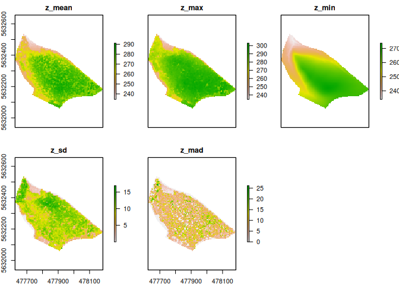
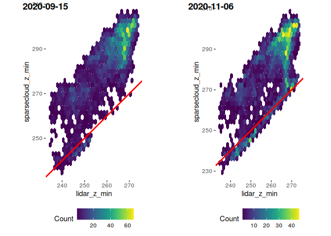
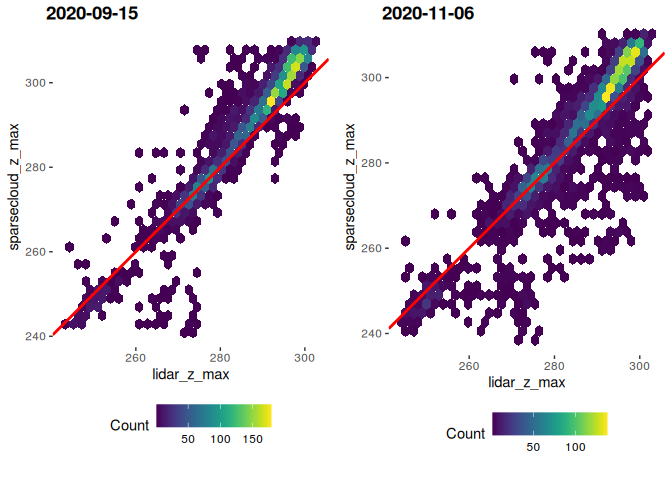
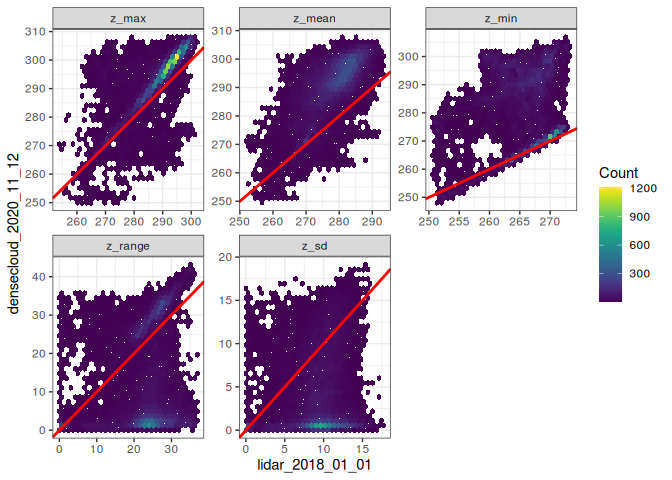
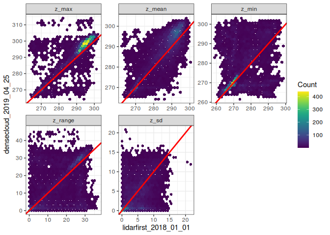
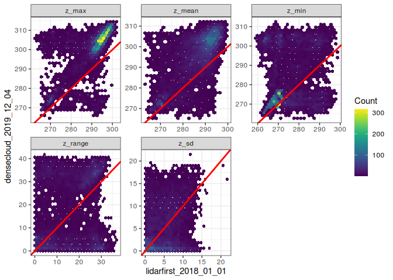
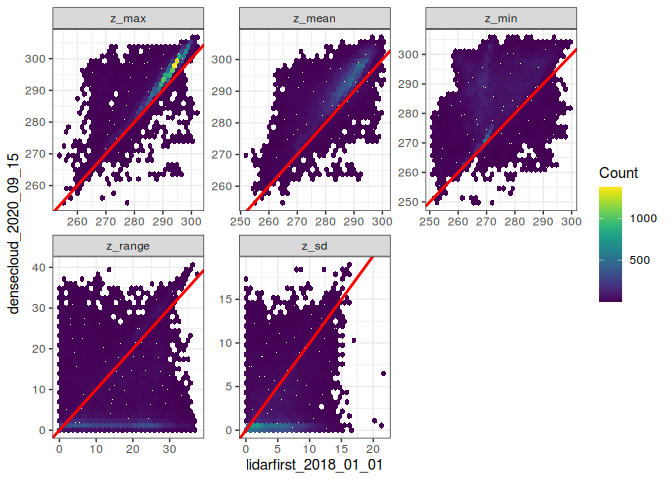
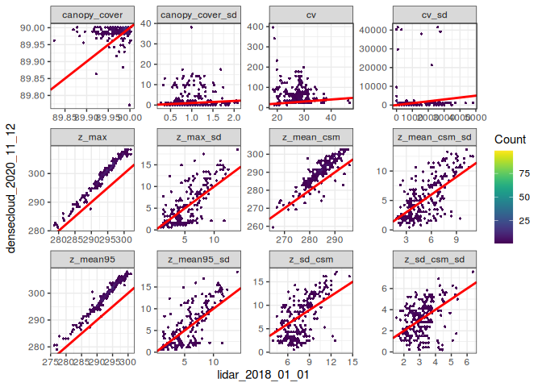

UAS Pointclouds vs. Lidar Pointclouds for structual analysis of forests
================

# Introduction

The use of Light detection and ranging (LiDAR) pointclouds are well
established in forestry, agriculture and forest research. Spatially
extensive estimations of vegetation related structural parameters are
mostly realised with the calculation of LiDAR indices in a regular grid.
Common applications on a forest stand scale are the retrieval of canopy
cover and heights (J. Lee et al. 2018; Alexander et al. 2014), stand
density (C.-C. Lee and Wang 2018) and the estimation of leaf area
(Kamoske et al. 2019). The structural information and its heterogeneity
in a landscape serve as indicators for biodiversity (Hilmers et al.
2018) or species occurrence (Carrasco et al. 2019; Melin et al. 2016;
Froidevaux et al. 2016). Most of these Lidar indices are strongly
correlated (Shi et al. 2018).

Despite their relevance in forest applications, Lidar data has some
major drawbacks, mainly in their cost and accessibility. Lidar sensors
and data acquisition are expensive and often distributed commercially.
Data provided by governmental institutions are for the most part still
irregularly available and not publicly distributed. Further, the
temporal resolution of the data is low (by law every 3 years in Germany)
making them not suitable for monitoring or applications which require
different seasonal conditions. With the recent development of unmanned
aerial systems (UAS) and photogrammetric techniques like structure from
motion (SfM), an alternative to Lidar pointclouds are available. Quick
data access in moderately large areas makes UAS data promising for the
monitoring of agricultural or natural systems (Manfreda et al. 2018).
Depending on flight conditions, these pointclouds could be acquired on a
near daily basis. Especially in forest environments, research can
benefit from vegetation structural information retrieved from UAS data.

UAS pointclouds do not have return values which many Lidar indices
depend on. Every point is a first return so we cannot get below a
developed canopy. These return values however are crucial for LiDAR
point classification (e.g. differentiate between ground and non ground
point).

The quality and viability of UAS pointclouds have to be assessed in
terms of comparability to Lidar pointclouds (since Lidar structural
analysis is the standard in many studies)

## Epic 1: Similarities between Lidar and UAS pointclouds

Since photogrammetically received pointclouds only capture the surface
and do not penetrate the forest canopy like Lidar pointclouds, different
phenological stages should capture different vertical layers of the
forest canopy. Therefore, the photogrammetrically received pointcloud
should represent and correlate with different parts of the Lidar
pointcloud. E.g. a flight without leafs in winter or early spring should
correlate well with the last returns of a lidar pointcloud (or a
leaf-off lidar campaign) and therefore should be suitable for creating
elevation models or the detection of tree stems and branches.

Further, a UAS flight at times with a fully developed canopy leads to
pointclouds where it is very unlikely to capture ground points. These
pointclouds should be comparable to first returns of a lidar pointcloud.
E.g. it was previously shown, that UAS pointclouds are very promising
for the estimation of tree heights and canopy cover.

**Hypothesis 1:** Photogrammetrically received pointclouds from
different phenological stages in a deciduous forest correlate with
different parts of a LiDAR derived pointcloud.

This relationship will be shown by comparing the vertical distributions
of both pointclouds in a regular grid. Further, the Lidar data will be
filtered to different return counts in order to check, which part of the
lidar data is represented.

## Epic 2: Multitemporal UAS pointclouds compared to Lidar pointclouds

If the positional accuracy of the individual photogrammetric pointclouds
is high enough (previously shown in Ludwig et al. (2020), it is a
resonable assumption to combine pointclouds from different phenological
stages in order to get a full 3D model of the forest. The positional
accuracy can be validated with tree positions and stem axis surveyed
with a totalstation **(How?)**.

**Hypothesis 2:** Mutlitemporal photogrammetrically received pointclouds
can substitude Lidar derived pointclouds for forest structural analysis.

This relation will be shown by comparing commonly used structural
indices like the `penetration rate` or the estimation of `biomass` from
both pointcloud types. Further, the structural data will be validated by
field work around at 15 plots where the vertical structure of the forest
was assessed.

# Methods

## Study Area

The study area is a 200 x 150 m part of a mixed deciduous forest near
Marburg (Germany). The area consists of a mix of oaks (\\textit{Quercus
spec.}) and beeches (\\textit{Fagus sylvatica}) and represent a typical
environment in a managed forest. The elevation ranges from XXXm to XXXm
a.s.l. Stem positions of 500 trees were acquired by using a differential
GPS (Zenith 35 Pro, GeoMax Widnau Switzerland) with a positioning
accuracy of 0.05 m.\\

## Common lidar indices

### Canopy cover

Usually canopy cover is derived from LiDAR as follows (over 10 different
studies cited in Bakx et al. (2019) Supplementary Material 3)

$$ \\frac{N\_{p &gt; x}}{N\_{t}} \* 100 $$

with percentage of returns (Np &gt; x) above x meter above ground level
at the raster resolution. Nt is the total number of returns. Bakx et al.
(2019) also mentiones Farrell et al. 2013 in which a tow part procedure
is described: First cover is estimated from aerial photographs, then it
is corrected by excluding areas with low canopy height derived from
LiDAR. UAS based pointclouds might very suitable for this approach,
since the pointcloud and the aerial image are received in the same
workflow.

### Canopy height

#### Maximum canopy height

Highest LiDAR return in a raster cell (over 10 different studies cited
in Bakx et al. (2019) Supplementary Material 3)

*Z**m**a**x*

#### Mean canopy height 95%

Mean height of the returns in the 95 percentile (Z95). N95 is the number
of returns in the 95 percentile

$$ Z\_{mean95} = \\frac{\\Sigma(Z\_{95})}{N\_{95}} $$

#### Mean canopy height (CSM)

Mean height of the canopy surface model (CSM) in the grid cell (first
return of the LiDAR). For Gap correction only points above a certain
threshold are used (over 10 different studies cited in Bakx et al.
(2019) Supplementary Material 3)

### Horizontal canopy variability

Usually the standard deviation of the canopy cover or canopy height in
larger raster cell (e.g. 10 m - reasonable to get to the sentinel
scale!)

### Vertical canopy variability

#### Coefficient of variation of canopy height (CV)

Ratio between mean canopy height (Zmean) and standard deviation (Zsd) of
canopy height (5 different studies cited in Bakx et al. (2019))

$$ CV = \\frac{Z\_{mean}}{Z\_{sd}} $$

#### Standard deviation of canopy height

Standard deviation of first returns in a raster cell (over 10 different
studies cited in Bakx et al. (2019) Supplementary Material 3)

# Results

## Correlation of common indices in a 1x1 m grid

### Lidar vs. Densecloud 2019-04-25

<!-- -->

### Lidar vs. Densecloud 2019-12-04

<!-- -->

### Lidar vs. Densecloud 2020-09-15

<!-- -->

### Lidar vs. Densecloud 2020-11-12

<!-- -->

## Correlations of common indices in a 10x10m grid

`_sd` denotes the standard deviation of the 1x1m index in the 10x10m
pixel

### Lidar vs. Densecloud 2019-04-25

<!-- -->

### Lidar vs. Densecloud 2019-12-04

<!-- -->

### Lidar vs. Densecloud 2020-09-15

<!-- -->

### Lidar vs. Densecloud 2020-11-12

<!-- -->

# Text fragments

The main challange for further usage of Lidar data in a forest
environment is the detection of individual trees. This enables the
estimation of tree related parameters such as diameter at breast height,
timber volume or crown related metrics (**Leeuwen2010?**). Forest
structure then can be described as the sum of the structure of
individual trees (e.g. their height and biomass **Ferraz2016?**) and the
species composition (REF). This could give new insights into ecosystem
functioning, since many processes and species distributions depend on
functions provided by trees or their related microhabitats (REF).
Further, monitoring of individual tree health and drought could be
applied in forestry.

# References

Alexander, Cici, Peder Klith Bøcher, Lars Arge, and Jens-Christian
Svenning. 2014. “Regional-Scale Mapping of Tree Cover, Height and Main
Phenological Tree Types Using Airborne Laser Scanning Data.” *Remote
Sensing of Environment* 147 (May): 156–72.
<https://doi.org/10.1016/j.rse.2014.02.013>.

Bakx, Tristan R. M., Zsófia Koma, Arie C. Seijmonsbergen, and W. Daniel
Kissling. 2019. “Use and Categorization of Light Detection and Ranging
Vegetation Metrics in Avian Diversity and Species Distribution
Research.” Edited by Damaris Zurell. *Diversity and Distributions* 25
(7): 1045–59. <https://doi.org/10.1111/ddi.12915>.

Carrasco, Luis, Xingli Giam, Monica Papeş, and Kimberly Sheldon. 2019.
“Metrics of Lidar-Derived 3d Vegetation Structure Reveal Contrasting
Effects of Horizontal and Vertical Forest Heterogeneity on Bird Species
Richness.” *Remote Sensing* 11 (7): 743.
<https://doi.org/10.3390/rs11070743>.

Froidevaux, Jérémy S. P., Florian Zellweger, Kurt Bollmann, Gareth
Jones, and Martin K. Obrist. 2016. “From Field Surveys to LiDAR: Shining
a Light on How Bats Respond to Forest Structure.” *Remote Sensing of
Environment* 175 (March): 242–50.
<https://doi.org/10.1016/j.rse.2015.12.038>.

Hilmers, Torben, Nicolas Friess, Claus Bässler, Marco Heurich, Roland
Brandl, Hans Pretzsch, Rupert Seidl, and Jörg Müller. 2018.
“Biodiversity Along Temperate Forest Succession.” Edited by Nathalie
Butt. *Journal of Applied Ecology* 55 (6): 2756–66.
<https://doi.org/10.1111/1365-2664.13238>.

Kamoske, Aaron G., Kyla M. Dahlin, Scott C. Stark, and Shawn P. Serbin.
2019. “Leaf Area Density from Airborne LiDAR: Comparing Sensors and
Resolutions in a Temperate Broadleaf Forest Ecosystem.” *Forest Ecology
and Management* 433 (February): 364–75.
<https://doi.org/10.1016/j.foreco.2018.11.017>.

Lee, Chung-Cheng, and Chi-Kuei Wang. 2018. “Estimating Stand Density in
a Tropical Broadleaf Forest Using Airborne LiDAR Data.” *Forests* 9 (8):
475. <https://doi.org/10.3390/f9080475>.

Lee, Junghee, Jungho Im, Kyungmin Kim, and Lindi Quackenbush. 2018.
“Machine Learning Approaches for Estimating Forest Stand Height Using
Plot-Based Observations and Airborne LiDAR Data.” *Forests* 9 (5): 268.
<https://doi.org/10.3390/f9050268>.

Ludwig, Marvin, Christian M. Runge, Nicolas Friess, Tiziana L. Koch,
Sebastian Richter, Simon Seyfried, Luise Wraase, et al. 2020. “Quality
Assessment of Photogrammetric MethodsA Workflow for Reproducible UAS
Orthomosaics.” *Remote Sensing* 12 (22): 3831.
<https://doi.org/10.3390/rs12223831>.

Manfreda, Salvatore, Matthew F McCabe, Pauline E Miller, Richard Lucas,
Victor Pajuelo Madrigal, Giorgos Mallinis, Eyal Ben Dor, et al. 2018.
“On the Use of Unmanned Aerial Systems for Environmental Monitoring,”
28.

Melin, M., J. Matala, L. Mehtätalo, J. Pusenius, and P. Packalen. 2016.
“Ecological Dimensions of Airborne Laser Scanning Analyzing the Role of
Forest Structure in Moose Habitat Use Within a Year.” *Remote Sensing of
Environment* 173 (February): 238–47.
<https://doi.org/10.1016/j.rse.2015.07.025>.

Shi, Yifang, Tiejun Wang, Andrew K. Skidmore, and Marco Heurich. 2018.
“Important LiDAR Metrics for Discriminating Forest Tree Species in
Central Europe.” *ISPRS Journal of Photogrammetry and Remote Sensing*
137 (March): 163–74. <https://doi.org/10.1016/j.isprsjprs.2018.02.002>.

