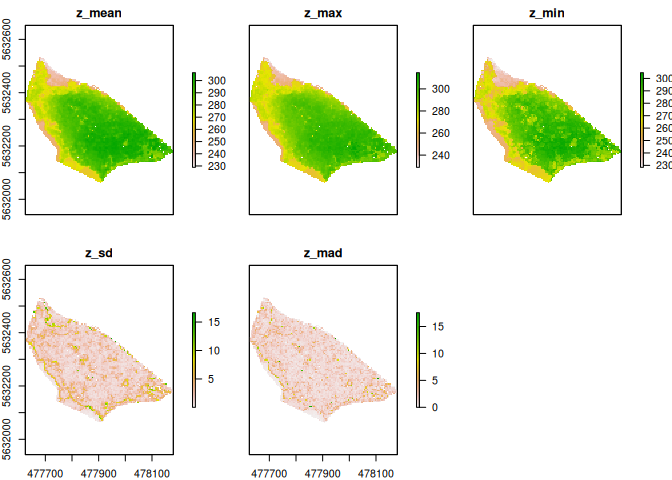
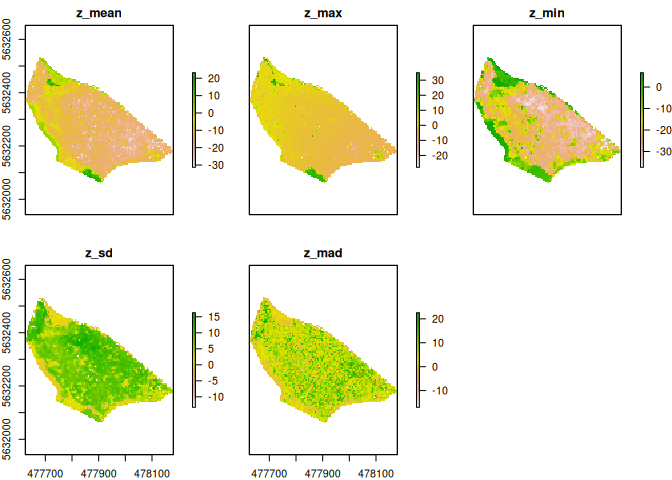

UAS Pointclouds vs. Lidar Pointclouds for structual analysis of forests
================

# Introduction

Lidar indices are commonly used for forest structural analysis…

## Difficulty level one: Lidar indices which does not use return count

## Processing protocol

-   crop lidar data to halfmoon
-   homogenize point density to 20 points per squaremeter

## Quick and dirty approach

``` r
lidar2018 = readLAS("../data/lidar/lidar2018_halfmoon_20p.las")
sparsecloud = readLAS("../data/sparseclouds/2020_10_13_sparsecloud.las")


source("../scripts/001_pointcloud_height_metrics.R")

sparsecloud_z_metrics = grid_metrics(sparsecloud, func = ~metrics(Z), res = 5)
lidar_z_metrics = grid_metrics(lidar2018, func ~metrics(Z), res = 5)


plot(lidar_z_metrics)
```

<!-- -->

``` r
plot(sparsecloud_z_metrics)
```

<!-- -->

``` r
z_dif = lidar_z_metrics - sparsecloud_z_metrics
plot(z_dif)
```

<!-- -->
